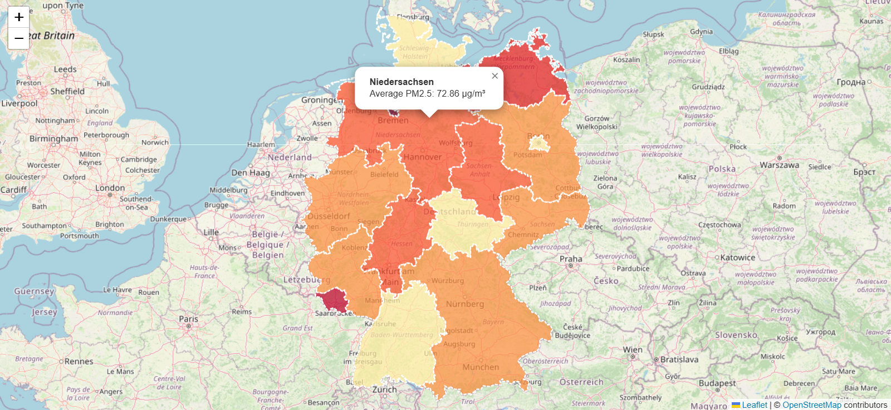

# Interactive Map of German Air Quality (PM2.5)

### ➡️ [**View the Live Demo Here!**](https://hossein-zamaninasab.github.io/Interactive-German-Map/)

This is a web-based, interactive choropleth map that visualizes the average annual PM2.5 air pollution levels across the 16 federal states of Germany. The project demonstrates the process of fetching, cleaning, processing, and visualizing real-world environmental data.

_Note: You need to replace placeholder.png with a real screenshot of your map._

## ✨ Features

-   **Interactive Choropleth Map**: States are color-coded based on their average PM2.5 levels, making it easy to spot regional differences.
-   **Data-driven Styling**: The color scale is dynamically applied based on the values in the processed dataset.
-   **Interactive Tooltips**: Hovering over a state highlights its borders.
-   **Informative Popups**: Clicking on a state reveals a popup with its name and exact average PM2.5 value.
-   **Live Demo**: The project is deployed using GitHub Pages for easy access.

## 🛠️ Tech Stack & Libraries

-   **Frontend**: HTML5, CSS3, JavaScript (ES6)
-   **Mapping Library**: [Leaflet.js](https://leafletjs.com/) - An open-source JavaScript library for interactive maps.
-   **Data Handling**: [D3.js](https://d3js.org/) - Used for efficiently loading and parsing the CSV data file.
-   **Data Processing**: The raw data was cleaned and aggregated manually using Microsoft Excel's PivotTable functionality.

## 📊 Data Source

The air quality data used in this project is official data from the German Environment Agency (Umweltbundesamt - UBA).

-   **Primary Source**: [UBA Air Data Portal - Annual Reports (Jahresbilanzen)](https://www.umweltbundesamt.de/daten/luft/luftdaten/jahresbilanzen-luftqualitaet)
-   **Geospatial Data**: The GeoJSON file for German state boundaries was sourced from the [GeoBoundaries dataset](https://github.com/geoboundaries/germany).

## 🚀 How to Run Locally

1.  Clone or download this repository.
2.  Due to browser CORS security policies for local files, you need to run this project through a local web server.
3.  The easiest way is to use the **Live Server** extension in Visual Studio Code. Simply right-click on `index.html` and select "Open with Live Server".

## 📄 License

This project is licensed under the MIT License.
